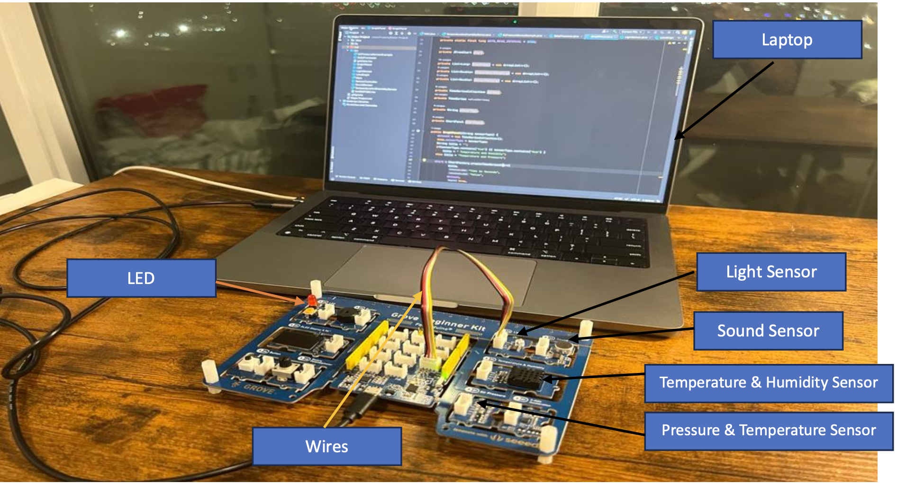
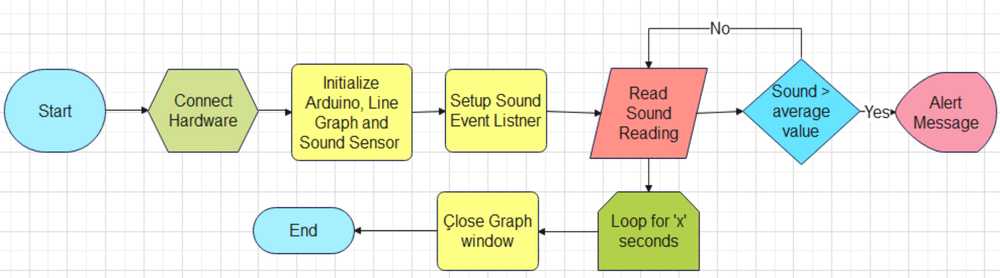
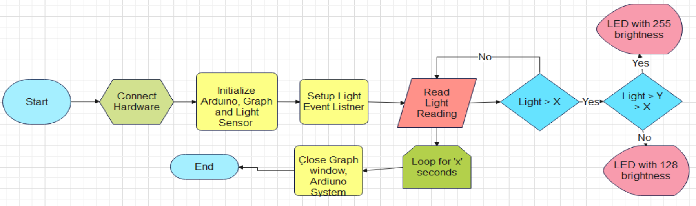
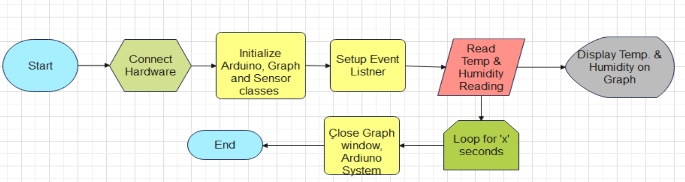
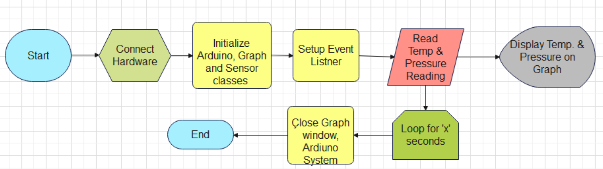
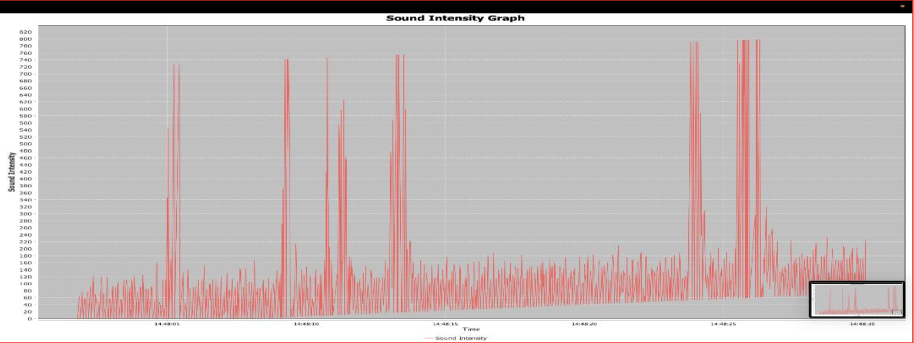
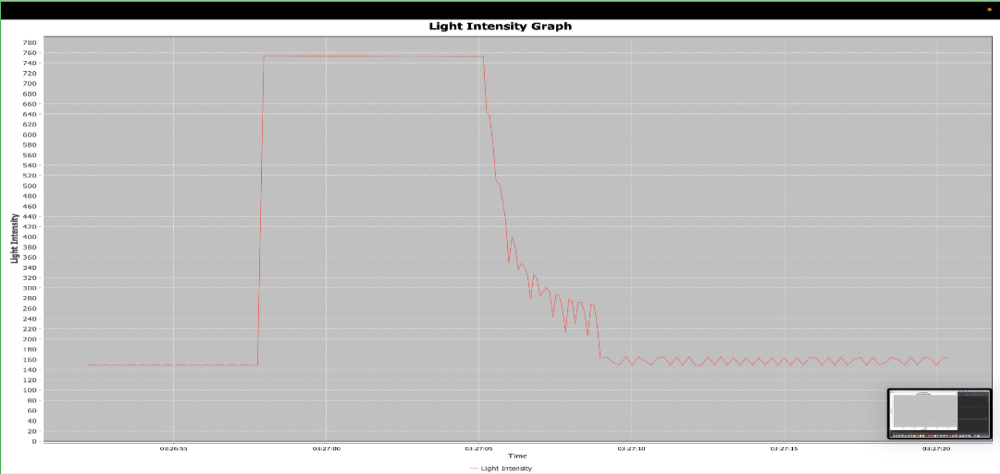
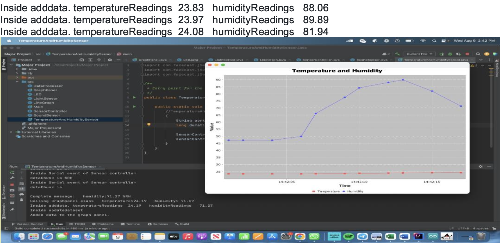
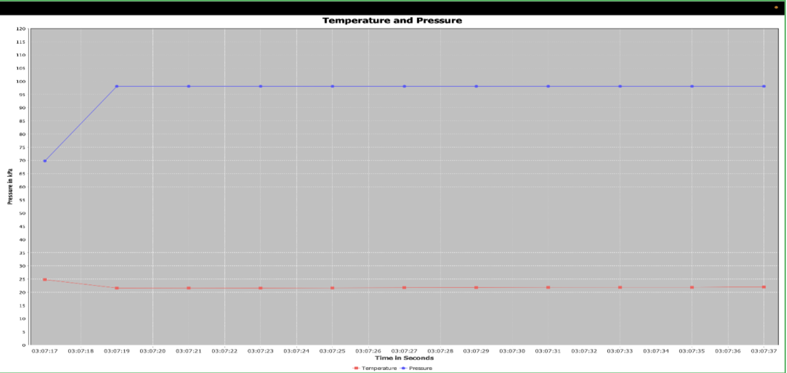

# 🌆 Smart Urban Environmental Monitoring System (Arduino + Java + Firmata4J)

An integrated **environmental monitoring system** that collects and visualizes real-time data for **light**, **sound**, **temperature**, **humidity**, and **pressure** using the **Grove Beginner Kit**, **Arduino**, and **Java** with **Firmata4J** and **JFreeChart**.  
The project aims to demonstrate how technology can contribute to sustainable **smart city** solutions.

---

🎯 **Objective**  
To design and implement a smart system that monitors key urban environmental parameters — including **noise**, **light intensity**, **temperature**, **humidity**, and **air pressure** — while triggering visual or sound alerts and displaying real-time graphs for data-driven urban management.

---

## 🧩 Features
- 🌡️ Real-time measurement of temperature, humidity, and pressure  
- 💡 Light sensor triggers LED when brightness exceeds threshold  
- 🔊 Sound sensor generates alerts for excessive noise levels  
- 📊 Dynamic data visualization using **JFreeChart**  
- 🧠 Multi-sensor data processing and event-driven responses  
- 🖥️ Integrated Java GUI for live graphing and logging  

---

## ⚙️ Hardware Components
| Component | Description |
|------------|-------------|
| **Grove Light Sensor** | Measures ambient light levels |
| **Grove Sound Sensor** | Detects noise intensity |
| **Grove Temperature & Humidity Sensor** | Monitors environmental conditions |
| **Grove Pressure Sensor** | Measures atmospheric pressure |
| **LEDs** | Provide visual output indicators |
| **Arduino UNO (Grove Kit)** | Central microcontroller |
| **Laptop (Arduino IDE + IntelliJ)** | Software processing and visualization |

---

## 🧰 Hardware Setup

  
   
  <em>Figure 1: Full setup with Grove kit, sensors, and laptop interface.</em>

---

## 💻 Software Overview
**Languages & Tools**
- **Arduino IDE** – Firmware programming  
- **Java (IntelliJ IDEA)** – Data processing and visualization  
- **Firmata4J** – Serial communication between Arduino and Java  
- **JFreeChart** – Graph plotting for live sensor data  

**Key Files**
| File | Description |
|------|--------------|
| `Main.java` | Main class controlling sound and light sensors |
| `SoundSensor.java` | Reads data from the sound sensor |
| `LightSensor.java` | Reads data from the light sensor |
| `LineGraph.java` | Displays real-time sound and light readings |
| `TemperatureAndHumiditySensor.java` | Monitors temperature and humidity |
| `AirPressureSensorExample.java` | Measures pressure and temperature |
| `SensorController.java` | Processes sensor input data |
| `DataProcessor.java` | Handles data computation and analysis |
| `GraphPanel.java` | Displays temperature, humidity, and pressure graphs |

---

## 🧩 System Flowcharts

  
  

  
  

<em>Figure 2: Flowcharts showing event-driven logic for each sensor module.</em>

---

## 📊 Sensor Data Graphs

### 🔊 Sound Intensity

  
   
  <em>Figure 3: Real-time sound level graph with threshold alerts.</em>

### 💡 Light Intensity

  
   
  <em>Figure 4: Light intensity graph with LED activation feedback.</em>

### 🌡️ Temperature & Humidity

  
   
  <em>Figure 5: Temperature and humidity readings visualized in JFreeChart.</em>

### 🌬️ Pressure Sensor

  
   
  <em>Figure 6: Pressure and temperature correlation graph.</em>

---

## 🧪 Testing
- Verified sensor readings against known references  
- Simulated sound and light changes for alert validation  
- Ensured accurate data refresh in real-time graph displays  

---

## 🎓 Learning Outcomes
- 💡 Improved understanding of **event-driven programming** in Java  
- 🔧 Enhanced skills in **sensor integration and calibration**  
- 🧠 Gained experience in **object-oriented software design**  
- 🧰 Strengthened debugging and testing techniques  

---

## 🧑‍💻 Author
**Shivam Gupta**  
🎓 B.Eng. Software Engineering @ York University  
📧 inbox11shivam@gmail.com  
🔗 [LinkedIn](https://linkedin.com/in/shivammmmg) • [Portfolio](https://shivammmmg.com)

---

## 📚 References
- [Grove Beginner Kit for Arduino](https://wiki.seeedstudio.com/Grove-Beginner-Kit-For-Arduino/)  
- [Firmata4J Library](https://github.com/kurbatov/firmata4j)  
- [JFreeChart Documentation](https://www.jfreechart.com)  
- [YorkU Firmata Java Guide](https://www.yorku.ca/professor/drsmith/2021/12/31/firmata-java/)
